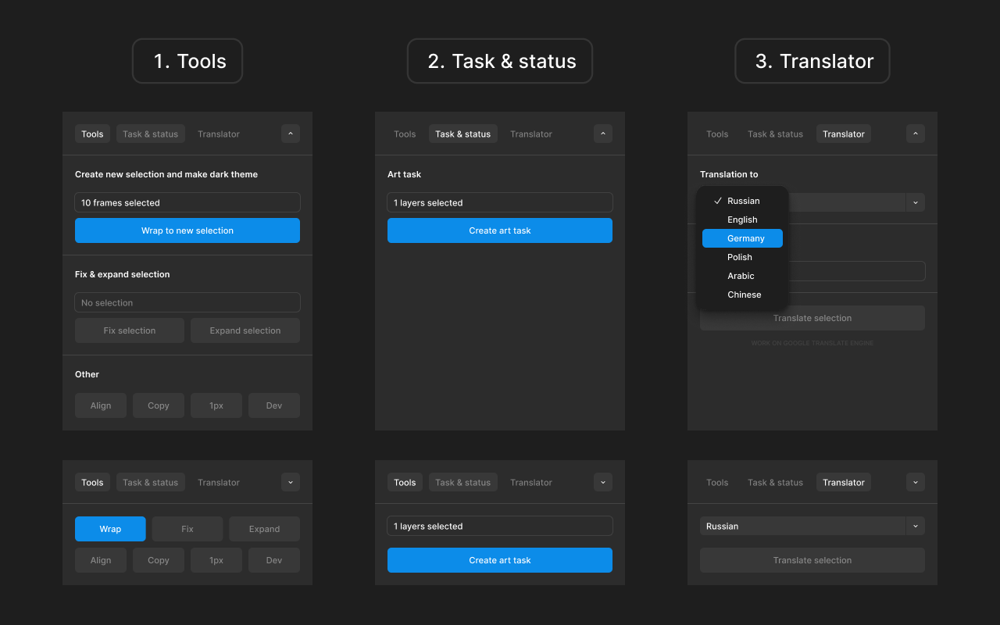

# Kiss Booster

Figma plugin with essential tools for speeding up design workflows. Organize sections, manage dark themes, create art tasks, translate text, and control statuses — all in one compact toolbar.



The plugin features a horizontal collapsible toolbar that stays out of your way until needed.

## Features

### Wrap / Fix

**Smart button that works contextually:**

- **With frames selected:** Wraps them into a section and aligns horizontally with 80px spacing. If dark mode variables exist, creates dark-theme copies below (with 160px spacing) and applies dark mode via variable modes
- **With section selected:** Removes old dark copies, realigns light frames inside the section, creates fresh dark copies with correct dark mode, and resizes the section to fit content
- **Without dark mode:** Just wraps and aligns frames without creating copies

Corner checkbox toggles dark-theme creation on/off.

### Align

Lays out all sections on the page (or selected ones) in rows:

- 6 sections per row, then wraps to next line
- 400px horizontal spacing between sections
- 400px vertical spacing between rows
- If sections are selected, alignment starts from the last selection point (its X and Y become the reference)

### 540px

Wraps the selected object into a 540px-wide auto-layout frame with 16px side padding. Object stretches to fill width; height rounds to 8px grid.

### Copy ← / →

**Smart directional copy:**

- Duplicates the selected frame left or right
- Inside a section, shifts neighbors and the section itself
- Standalone frame is simply copied to the side
- Auto-expands sections if they would overlap, maintaining 400px minimum gap

### Find

Selects every object on the page with the same name and size as the selected one.

### Replace

Replaces all selected objects with a copy of the reference (last-selected object), keeping each target's position and size.

### 1px

Wraps selected objects in 1px-border frames for clean slicing/export. Handles rotated objects correctly.

### Art

Fills the selected ArtTask with the target object's size (×3 for production) and draws a green arrow pointing to the object.

### Translate

Replaces the toolbar with language flags — pick one to translate all text layers in the selection via Google Translate API.

Supported languages: Russian, English, German, Polish, Arabic, Chinese, French, Japanese, Korean.

### Dev

Toggles "Ready for Dev" on selected sections/frames, or on all sections if nothing is selected.

### Zero

Moves the single selected object to coordinates (0, 0).

## UI Features

### Horizontal Toolbar

Compact button grid that expands on demand:

- **Collapsed:** First 3 tools + more button (arrow)
- **Expanded:** All 11 tools visible
- Buttons don't morph — hidden buttons use CSS display:none

### Settings Panel

- **Position:** Choose where plugin opens (4 corners + center)
- **Theme:** Toggle light/dark mode
- **Reorder:** Drag buttons to customize toolbar order
- **FAQ:** View detailed descriptions of all features
- **Reset:** Clear all saved settings

### FAQ

Expandable help panel with 11 feature descriptions, icon indicators, and smooth navigation.

### Position Picker

5 zones (4 corners + center) with visual brackets/icons. Plugin remembers your choice and opens in that position next time.

### Theme Toggle

Light/dark mode switcher with persistent state. Theme affects the entire plugin UI.

### Button Reorder

Drag-and-drop reorder mode accessible from Settings. Your custom order is saved automatically.

## Installation

1. Clone or download this repository
2. In Figma: Plugins → Development → Import plugin from manifest → select `manifest.json`

Plugin is ready to use immediately — build is included in the repo.

## Development

```bash
npm install
npm run build    # build once
npm run watch    # rebuild on changes
```

## Requirements

- Figma desktop
- For dark theme: variable collection with "Dark" mode (local or from library)
- For art tasks: ArtTask component in file (at least one instance on current page)
